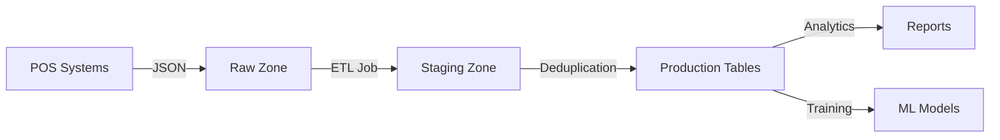

# Data Lineage Guide

## Overview

Этот guide описывает управление lineage (происхождением данных) в Spark K8s Constructor deployment.

## Current State: Manual Documentation

### What is Data Lineage?

Data lineage — отслеживание происхождения данных от источников до потребителей:
- **Source Systems** → ETL Jobs → Staging Tables → Transformations → Production Tables → Consumers

### Manual Lineage Documentation

#### 1. Dataset README Files

Каждый dataset должен иметь README.md с информацией о происхождении:

```markdown
# sales_transactions Dataset

## Description
Transactional sales data from POS systems.

## Source
- System: POS (Point of Sale)
- Frequency: Hourly
- Format: JSON
- Location: s3a://raw/sales/transactions/

## Transformations
1. Raw JSON → Staging (schema normalization)
2. Staging → Production (deduplication, enrichment)

## Dependencies
- Depends on: raw/sales/transactions/
- Consumed by: analytics/daily_sales_report, ml/sales_forecast

## Owner
Team: Data Engineering
Contact: data-eng@company.com
```

#### 2. Job Documentation

Каждый Spark job должен документировать lineage:

```python
"""
Daily Sales ETL Job

Source:
  - s3a://raw/sales/transactions/ (raw POS data)

Transformations:
  1. Parse JSON schema
  2. Deduplicate by transaction_id
  3. Enrich with product catalog
  4. Calculate daily aggregates

Output:
  - s3a://production/sales/transactions/ (transaction fact table)
  - s3a://production/sales/daily_summary/ (daily aggregates)

Dependencies:
  - product_catalog table
  - store_locations table

Consumed by:
  - Daily Sales Report (Grafana dashboard)
  - Sales Forecast (ML model)
"""
```

#### 3. Lineage Tracking Table

Создайте специальную таблицу для tracking:

```sql
CREATE TABLE governance.data_lineage (
  source_system STRING,
  source_path STRING,
  target_table STRING,
  transformation_type STRING,
  job_name STRING,
  last_updated TIMESTAMP,
  owner STRING
);
```

```python
# Update lineage after each job
from datetime import datetime

lineage_data = [
    ("POS", "s3a://raw/sales/transactions/", "production.sales.transactions", "etl", "daily_sales_etl", datetime.now(), "data-eng")
]

spark.createDataFrame(lineage_data, lineage_schema) \
    .write \
    .mode("append") \
    .saveAsTable("governance.data_lineage")
```

### Visualization: Manual Diagrams

Создавайте lineage diagrams используя Markdown mermaid:

```markdown
## Data Lineage


```

## Column-Level Lineage

### Documentation Pattern

```markdown
## sales_transactions Column Lineage

| Column | Source | Transformation | Notes |
|--------|--------|----------------|-------|
| transaction_id | raw.transaction_id | Direct mapping | Primary key |
| customer_id | raw.customer_id | Direct mapping | Foreign key |
| amount | raw.amount | Currency conversion | USD → EUR |
| timestamp | raw.timestamp | Timezone conversion | UTC → Europe/Berlin |
| is_valid | — | Computed | NOT NULL AND amount > 0 |
```

### Spark Column Comments

```python
from pyspark.sql.functions import col

# Add column comments for lineage
df.write \
    .mode("overwrite") \
    .option("comment", "Transactional sales data from POS systems") \
    .saveAsTable("production.sales.transactions")

# Column-level lineage
sql = """
ALTER TABLE production.sales.transactions
ALTER COLUMN transaction_id COMMENT 'Direct mapping from raw.transaction_id'
"""
spark.sql(sql)
```

## Dependency Tracking

### Upstream Dependencies

```python
# Document upstream dependencies in job config
job_config = {
    "name": "daily_sales_etl",
    "dependencies": [
        "s3a://raw/sales/transactions/",
        "production.catalog.products",
        "production.reference.stores"
    ],
    "outputs": [
        "production.sales.transactions",
        "production.sales.daily_summary"
    ]
}
```

### Downstream Consumers

```python
# Track downstream consumers
consumers = [
    {"table": "production.sales.transactions", "consumer": "analytics.sales_report", "type": "report"},
    {"table": "production.sales.transactions", "consumer": "ml.sales_forecast", "type": "model"},
    {"table": "production.sales.daily_summary", "consumer": "executive_dashboard", "type": "dashboard"}
]

spark.createDataFrame(consumers) \
    .write \
    .mode("append") \
    .saveAsTable("governance.data_consumers")
```

## Future: DataHub

### What is DataHub?

DataHub — modern metadata platform с:
- Automated lineage extraction
- UI для просмотра lineage
- Search и discovery
- Data catalog integration

### DataHub Architecture

```
┌─────────────────────────────────────────────┐
│                 DataHub                      │
├─────────────────────────────────────────────┤
│  Frontend (React UI)                        │
│  GMS (Global Metadata Service)              │
│  Metadata Model (Graph)                      │
│  ┌───────────────┐  ┌───────────────────┐   │
│  │  ETL Extraction│  │  SQL Parsing      │   │
│  └───────────────┘  └───────────────────┘   │
│  ┌───────────────┐  ┌───────────────────┐   │
│  │  Spark Plugin │  │  Hive Metastore   │   │
│  └───────────────┘  └───────────────────┘   │
└─────────────────────────────────────────────┘
```

### DataHub Deployment (Future)

```bash
# Install DataHub
helm repo add datahub https://helm.datahubproject.io
helm install datahub datahub/datahub -n governance --create-namespace

# Enable Spark lineage capture
spark-submit \
  --conf spark.extraListeners=acryl.datahub.spark.lineage.DataHubSparkListener \
  --conf spark.datahub.rest.server=http://datahub-gms:8080 \
  --conf spark.datahub.auth.token=YOUR_TOKEN
```

### DataHub Lineage Example

```python
# DataHub automatically captures this lineage
df = spark.read.table("production.sales.transactions")
result = df.groupBy("store_id").agg({"amount": "sum"})
result.write.mode("overwrite").saveAsTable("analytics.sales_by_store")

# In DataHub UI:
# production.sales.transactions → [daily_sales_agg] → analytics.sales_by_store
```

## Best Practices

### 1. Document Early

```python
# Add lineage documentation at job development time
job_doc = """
Job Name: daily_sales_etl
Purpose: Aggregate daily sales by store

Lineage:
  Inputs: production.sales.transactions
  Output: analytics.sales_by_store

Transformations:
  - Group by store_id, date
  - Sum amount
  - Count transactions
"""

# Save to governance table
spark.createDataFrame([(job_doc,)], ["lineage_doc"]) \
    .write \
    .mode("overwrite") \
    .text("s3a://governance/lineage/daily_sales_etl/")
```

### 2. Version Control Documentation

```bash
# Store lineage docs in git
docs/lineage/
├── sales/
│   ├── daily_sales_etl.md
│   └── sales_forecast_training.md
└── marketing/
    └── campaign_attribution.md
```

### 3. Automate Where Possible

```python
# Auto-generate lineage diagram
def generate_lineage_graph(df, output_table):
    """Generate mermaid graph from DataFrame operations"""
    sources = df.inputFiles()
    print(f"```mermaid")
    print(f"graph LR")
    for i, source in enumerate(sources):
        print(f"  S{i}[{source}] --> T[{output_table}]")
    print(f"```")

# Use in job
generate_lineage_graph(sales_df, "production.sales.transactions")
```

### 4. Regular Updates

```bash
# Monthly lineage review meeting
# Check:
# - New datasets documented?
# - Old datasets still accurate?
# - Broken dependencies?
# - Orphaned tables?
```

## Troubleshooting

### Missing Lineage Information

**Problem:** New table has no lineage documentation

**Solution:**
```sql
-- Query lineage table
SELECT * FROM governance.data_lineage WHERE target_table = 'unknown_table';

-- If missing, investigate source code
grep -r "unknown_table" jobs/
```

### Broken Lineage Chain

**Problem:** Downstream job fails, upstream changed

**Solution:**
```python
# Check dependencies
def check_lineage(table):
    consumers = spark.sql(f"""
        SELECT consumer, type
        FROM governance.data_consumers
        WHERE table = '{table}'
    """).collect()

    for consumer in consumers:
        print(f"Notifying {consumer.consumer} about breaking change")
        # Send notification
```

## Audit & Compliance

### SOX Compliance

```sql
-- Generate lineage report for auditors
SELECT
    source_system,
    source_path,
    target_table,
    job_name,
    last_updated,
    owner
FROM governance.data_lineage
WHERE target_table LIKE 'production.%'
ORDER BY last_updated DESC;
```

### GDPR Right to Explanation

```sql
-- Find all ML models using customer data
SELECT
    consumer,
    type,
    'Uses customer PII data' as privacy_impact
FROM governance.data_consumers
WHERE target_table IN (
    SELECT target_table
    FROM governance.data_lineage
    WHERE source_system = 'CRM'
);
```

## References

- DataHub: https://datahubproject.io/
- OpenLineage: https://openlineage.io/
- Amundsen: https://www.amundsen.io/

---

**Governance Status:** Manual lineage patterns documented. DataHub implementation deferred to future phases.
